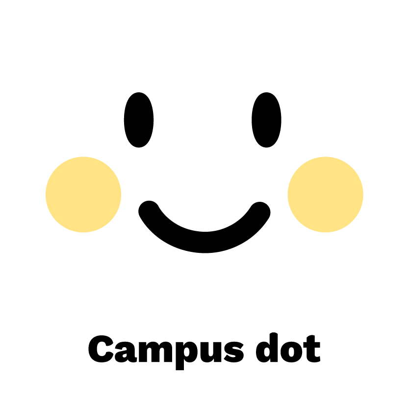

# __CAMPUSDOT__

#### CampusDot is ```WANTED HACKATHON``` project application that can see other people's recommended StoreLists. 

#### And You can Challenge these Lists. Also, you can get informations about restaurant with your college student's reviews. 

#### So you will be easy to choose where to go alone or with your friends.

#### Languages: React-Native, JavaScript

## __Documentation__
You can find how to use components, providers in here.
### [main docs](/docs/main.md)

## __Directory Structure__
All of source files in __/src__ directory 

### /components
Write part of views in each section.
Make reusable components.
### /constants
Write server baseUrl, app main colors, frequently used styles in here.
### /context
Write Context, Reducer in here(Api calls).
It is related to each screens (e.g. StoreList screens...) shared data that is fetched from server (e.g. Auth, College...) and it's function(reducer).
+ Auth, College, Review, Search, StoreList, Uesr exists.
### /lib
axios setting to communicate with server.
utils files in here.
### /navigation
Divide into Auth, Main Stack and Tab Screen in navigation.
### /providers
Write reusable varibles(state), function in many components, screens. (like redux)
It is not data fetched from server just to use not passing props in every components.
+ #### ReviewCreate
    + It is for dealing with Creating Review.
+ #### StoreListCreate
    + It is for dealing with Creating StoreList.  
+ #### Search
    + It is for dealing with Search.
### /public
Locate static files in here.
### /screens
Main Screen of App with templates.
+ #### Auth
    + for the related with Auth Screen. (SignIn, SingOut)
+ #### Main
    + for the related with Main Screen. (Home, Stamp, Create, Notice, MyPage, Splash)
### /templates
Templates consists of many components used in Screens. directory is similar with screens.
### /widgets
Simple widgets in here.